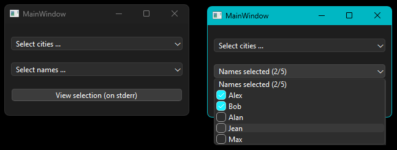

# Qt6 ComboBox of CheckBoxes
This tiny repo shows how to populate a QComboBox with checkable items.

This feature has been a recurring request since Qt4 but has never received an official solution :-(

## Features

- Works with Qt6 (tested with Qt 6.8 LTS, C++17)
- Setups two QComboBox (shows how to minimize code duplication)
- Can be applied to existing forms (no need to promote existing QComboBox to a new class)
- Can reuse items defined by a ComboBox in an existing form.ui and converts them into checkable items.
- Can set a '_title_' (aka input field) to the ComboBox (see video below)
- Provided as a git repo (easy to duplicate ;-)

## Demo

**Video:**

https://github.com/user-attachments/assets/0110c0a9-f2ec-4f70-a819-0b68e0f63823

## Notes
- In mainwindows.h there is a macro `#define TRACK_CHANGES 1` to enable/disable
the tracking of the chekboxes used to update the title of the ComboBox.
- This is a simple demonstration. There are many possible improvements.
- Another approach is to subclass the QComboBox class.

## References

This demo is based on explantions and code from these url:

1. http://programmingexamples.net/wiki/Qt/ModelView/ComboBoxOfCheckBoxes (2011)
2. https://stackoverflow.com/questions/8422760/combobox-of-checkboxes (2011-2019)
4. https://notes84.blogspot.com/2016/05/c-qt56-combobox-with-checkboxes.html (2016)
3. https://gist.github.com/mistic100/c3b7f3eabc65309687153fe3e0a9a720 (2017)

## About SO

I posted a reply to [stackoverflow](https://stackoverflow.com/questions/8422760/combobox-of-checkboxes) including a link to **this** repo.
I quickly received an mail from the _Stack Overflow Moderation Team_:

> Promotional content: We noticed that at least some of your posts seem to promote and/or link to a product, website, blog, library, YouTube channel/videos, project, source code repository, etc. 

Then the post has been deleted with this explanation :

> While this link may answer the question, it is better to include the essential parts of the answer here and provide the link for reference.
> Link-only answers can become invalid if the linked page changes. - From [Review](https://stackoverflow.com/review/low-quality-posts/37095321)
